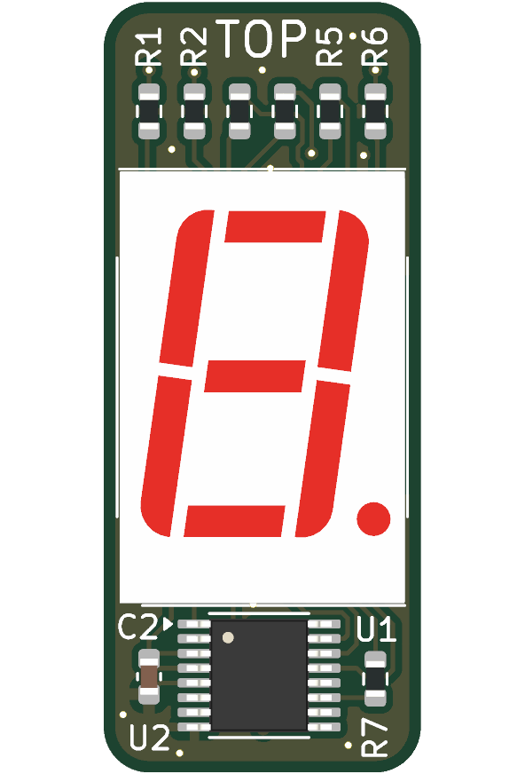
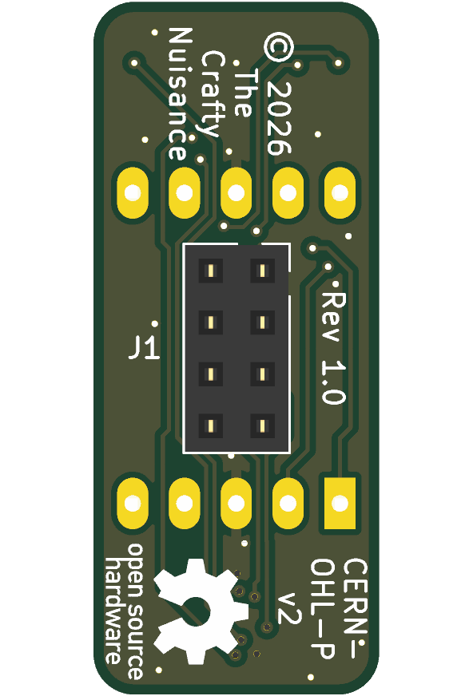

# 1-digit BCD Bus Visualizer
This component is part of the Crafty Computer series.

It is designed in **[KiCad](https://www.kicad.org/) 10.0** and released under the [CERN-OHL-P](https://ohwr.org/cern_ohl_p_v2.txt), either version 2 or (at your option) any later version.  This design is **not backwards compatible with KiCad 9.0 or earlier**.

Please refer to the [documentation/](./documentation/) and [production/](./production/) folders for PDF schematics and Gerber files.

## What is this?
The Crafty Computer includes a lot of 4-bit buses to move data around the ALU and to/from/between the digit units.  This optional add-on displays the value currently on the bus on a seven-segment display.

The bus header can also be connected to an oscilloscope or left unpopulated.  The value on the bus is always shown on four LEDs, so this is just a convenience.

## How does it work?
This module does not follow the general design principles of the Crafty Computer.  To keep it small enough that it doesn't obscure the view of the entire board it's attached to, it uses a 7-segment decoder IC to do all the work.  You can disconnect this module from the computer with no impact on its operation, demonstrating that the IC is not secretly the brain of the operation.

It doesn't try to handle a floating bus gracefully.  If it shows junk, that's the same junk that a real reader would read from the bus.  It also uses a `0`-`9` decimal decoder that doesn't show the invalid `a`-`f` values, because those values should rarely be seen in a BCD computer. Specifically, they are seen as intermediate values inside the ALU before being corrected by adding 6 to get `0x10` instead of `0xa`, but the 1-digit BCD Bus Visualizer is not the right tool to visualize that "bus".  You would need a 4-bit Bus Visualizer, or a scope.

## License
This open source hardware is provided under the [CERN-OHL-P](https://ohwr.org/cern_ohl_p_v2.txt), either version 2 or (at your option) any later version.

© 2026 The Crafty Nuisance

You may redistribute and modify this documentation and make products using it under the terms of the CERN-OHL-P v2 ([https:/cern.ch/cern-ohl]).  This documentation is distributed WITHOUT ANY EXPRESS OR IMPLIED WARRANTY, INCLUDING OF MERCHANTABILITY, SATISFACTORY QUALITY AND FITNESS FOR A PARTICULAR PURPOSE. Please see the [CERN-OHL-P v2](https://ohwr.org/cern_ohl_p_v2.txt) for applicable conditions.

## Images
### Front View

### Back View

